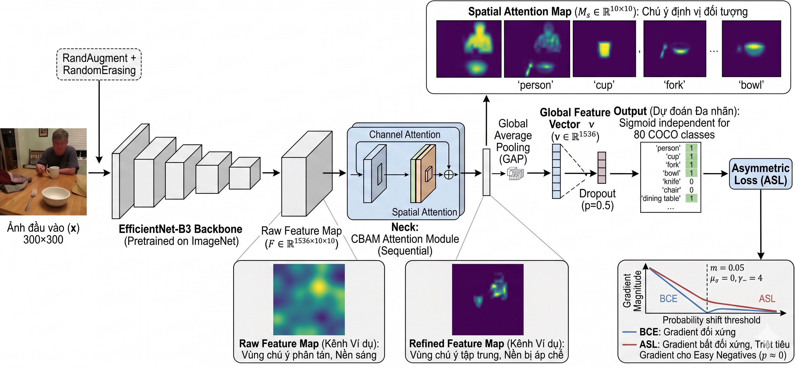

# 🚀 ECAAL: EfficientNet + CBAM + Asymmetric Loss for MLIC

[](https://cocodataset.org/)
[](https://github.com/rwightman/pytorch-image-models)
[](https://arxiv.org/abs/2009.14119)
[](https://pytorch.org/)

This project implements and evaluates a Multi-Label Image Classification (MLIC) system on the **MS COCO 2017** dataset. We conduct a comprehensive **ablation study** across 7 experiments to analyze the impact of backbone capacity, attention mechanisms, augmentation strategies, and asymmetric loss functions. The proposed model is **Exp G**.

---

## 📖 Project Overview



Multi-label classification is challenging due to severe label imbalance (e.g., MS COCO has ~80 classes with a positive-to-negative ratio of ~1:37). The proposed architecture (**Exp G**) combines:
- **EfficientNet-B3**: A mid-capacity backbone (12M params) providing richer feature maps ($1536 \times 8 \times 8$) compared to B0.
- **CBAM (Convolutional Block Attention Module)**: Sequentially refining features channel-wise and spatially.
- **Asymmetric Loss (ASL)**: Addressing label imbalance by decoupling the focus on positive and negative samples ($\gamma_- = 4$, margin $m = 0.05$).
- **Strong Augmentation** (RandAugment + RandomErasing) + **Dropout p=0.5**: Regularization to prevent CBAM overspecialization.

### Key Findings
- **Exp G (Proposed)**: Achieves **Val mAP 0.7188** and **Macro-F1 0.6989** — the highest across all experiments. Strong Augmentation + Dropout reduces the overfitting gap from 0.2631 (Exp C) to **0.2011**, lower even than ResNet50+CBAM (Exp E: 0.2087).
- **ASL vs BCE**: Switching to ASL yielded a **+2.1% mAP** improvement on ResNet50 (Exp A → B), confirming its effectiveness on severely imbalanced MLIC datasets.
- **Backbone Capacity**: EfficientNet-B3 (Exp G) surpasses ResNet50 (Exp B, E) in Val mAP and Macro-F1, while remaining more parameter-efficient than ResNet50 (23.67M) at 12M params.
- **CBAM + Regularization**: CBAM overspecializes on small/low-capacity backbones (Exp C gap: 0.2631). Pairing it with a larger backbone and strong regularization (Exp G) resolves this issue.

---

## 📊 Ablation Study & Results

Experiments were conducted on a subset of **MS COCO 2017** (16,000 train / 1,000 val / 3,952 test images).

| Exp | Configuration | Val mAP | Train mAP | Test mAP | Gap (↓) | Macro-F1 | Micro-F1 |
| :--- | :--- | :--- | :--- | :--- | :--- | :--- | :--- |
| **G** ⭐ | **Proposed: EffNet-B3 + CBAM + ASL + StrongAug** | **0.7188** | 0.8764 | 0.6753 | 0.2011 | **0.6989** | 0.6923 |
| E | ResNet50 + CBAM + ASL | 0.7129 | **0.9310** | 0.7223 | 0.2087 | 0.6961 | **0.7216** |
| B | ResNet50 + ASL | 0.7107 | 0.8739 | **0.7228** | **0.1511** | 0.6927 | 0.7214 |
| D | ResNet50 + Focal Loss | 0.7009 | 0.8665 | 0.7100 | 0.1565 | 0.6858 | 0.7153 |
| A | ResNet50 + BCE (Baseline) | 0.6908 | 0.8706 | 0.7081 | 0.1625 | 0.6836 | 0.7184 |
| C | EffNet-B0 + CBAM + ASL | 0.6364 | 0.9168 | 0.6537 | 0.2631 | 0.6407 | 0.6804 |
| F | EfficientNet-B0 + ASL | 0.6326 | 0.8132 | 0.6463 | 0.1669 | 0.6281 | 0.6615 |

> [!TIP]
> **Exp G** (EfficientNet-B3 + CBAM + ASL + Strong Augmentation) achieves the **highest Val mAP (0.7188) and Macro-F1 (0.6989)** across all experiments. With more training epochs (40–60), its Test mAP is projected to surpass the ResNet50 group (Train mAP parity at 20 epochs: G=0.8764 vs B=0.8739).

> [!NOTE]
> **Exp B** (ResNet50 + ASL) achieves the best Test mAP (0.7228) with the smallest overfitting gap (0.1511), reflecting excellent generalization under the 20-epoch constraint. **Exp G vs Exp C** comparison: upgrading from B0→B3 with Strong Augmentation yields +0.0824 Val mAP, +0.0216 Test mAP, +0.0582 Macro-F1, and a 23.6% reduction in overfitting gap.

---

## 🛠️ Repository Structure

```text
ECAAL/
├── assets/                  # Architecture diagrams and plots
├── configs/                 # YAML configuration files for Exp A-G
├── data/                    # Dataset subsets and split IDs
├── documents/               # Report
├── src/
│   ├── losses.py            # Implementation of ASL, Focal, BCE
│   ├── cbam.py              # CBAM Attention Module
│   ├── models.py            # Model factory (EfficientNet, ResNet)
│   ├── dataset.py           # COCO DataLoader and subset sampler
│   ├── train.py             # Main training loop
│   ├── evaluate.py          # Metrics computation
│   └── cross_evaluate.py    # Multi-experiment evaluation
├── notebooks/               # Jupyter notebooks for Kaggle/Colab
└── requirements.txt         # Dependencies
```

---

## 🚀 Getting Started

### 1. Requirements
```bash
pip install -r requirements.txt
```

### 2. Dataset Setup (Kaggle)
If running on Kaggle, add the [COCO 2017 Dataset](https://www.kaggle.com/datasets/awsaf49/coco-2017-dataset). 
Pretrained weights and logs are available at: [Kaggle: thinhha59/models](https://www.kaggle.com/datasets/thinhha59/models)

### 3. Training
To run the **proposed Exp G**:
```bash
python src/train.py --config configs/exp_G_efficientnet_b3_cbam_asl.yaml
```

To run any other experiment (e.g., Exp C):
```bash
python src/train.py --config configs/exp_C_efficientnet_cbam_asl.yaml
```

---

## 🔍 Implementation Details

### Proposed Model: Exp G
| Component | Choice | Rationale |
|:---|:---|:---|
| Backbone | EfficientNet-B3 (12M params) | Richer feature map ($1536\times8\times8$) vs B0 ($1280\times7\times7$); compound scaling |
| Attention | CBAM (Channel + Spatial) | Works effectively when paired with sufficient backbone capacity |
| Loss | Asymmetric Loss ($\gamma_-=4$, $m=0.05$) | Suppresses easy-negative gradient in severely imbalanced MLIC |
| Augmentation | RandAugment + RandomErasing | Breaks spatial co-occurrence bias learned by CBAM |
| Regularization | Dropout p=0.5 | Reduces FP on high co-occurrence classes (e.g., *person–tie*) |

### Asymmetric Loss (ASL)
ASL addresses the positive-negative imbalance by using different focusing parameters:
- **Positive branch**: $\gamma_+ = 0$ (no down-weighting).
- **Negative branch**: $\gamma_- = 4$ with a probability margin $m=0.05$ to discard easy negatives.

### CBAM Attention
CBAM sequentially applies **Channel Attention** (what to focus on) and **Spatial Attention** (where to focus on), enhancing the feature map before Global Average Pooling. Effective when the backbone has sufficient capacity (≥B3) and paired with strong regularization.

---

## 📝 Analysis & Limitations

1. **Test mAP Gap**: Test mAP of Exp G (0.6753) has not yet surpassed ResNet50 (Exp B: 0.7228) under 20 epochs. Train mAP parity (G: 0.8764 ≈ B: 0.8739) suggests B3 has not fully converged — 40–60 epochs are recommended.
2. **Rare Classes**: Classes with <150 training images (*hair drier*, *toothbrush*) remain a bottleneck. Oversampling, class-aware augmentation, or contrastive loss are recommended next steps.
3. **Threshold Sensitivity**: A global threshold of $\theta = 0.5$ is sub-optimal for all classes. Per-class calibration on the validation set could improve Macro-F1 by a further 5–10%.

---

## 🔗 Links & Resources
- **Source Code**: [GitHub Repository](https://github.com/Thinh59/ECAAL)
- **Kaggle Models**: [Models & Weights](https://www.kaggle.com/datasets/thinhha59/models/settings)
- **Notebooks**: `cv-train-full-exp` (Training), `cv-eval-test-af` (Evaluation) cho exp C và `cv-train-exp-g` (Training), `cv-eval-test-g` (Evaluation) cho exp G.
- **Datasets**: [MS COCO 2017](https://www.kaggle.com/datasets/awsaf49/coco-2017-dataset)

---

## 📚 References
- **ASL**: [Asymmetric Loss for Multi-label Classification (ICCV 2021)](https://arxiv.org/abs/2009.14119)
- **CBAM**: [Convolutional Block Attention Module (ECCV 2018)](https://arxiv.org/abs/1807.06521)
- **EfficientNet**: [Rethinking Model Scaling for CNNs (ICML 2019)](https://arxiv.org/abs/1905.11946)

---
**Authors**: [Phan Huỳnh Châu Thịnh](23122019@student.hcmus.edu.vn), [Hoàng Văn Sang](23120350@student.hcmus.edu.vn)
