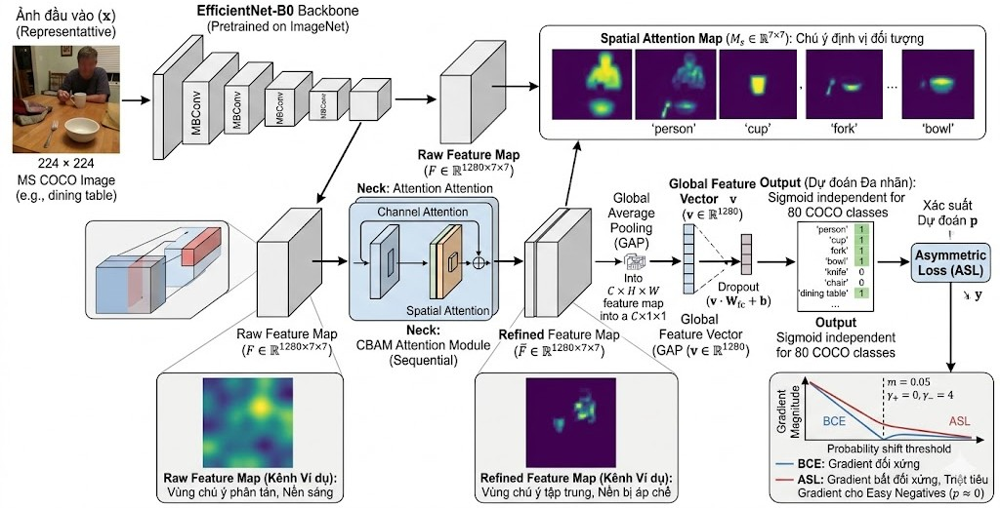

# 🚀 ECAAL: EfficientNet + CBAM + Asymmetric Loss for MLIC

[](https://cocodataset.org/)
[](https://github.com/rwightman/pytorch-image-models)
[](https://arxiv.org/abs/2009.14119)
[](https://pytorch.org/)

This project implements and evaluates a Multi-Label Image Classification (MLIC) system on the **MS COCO 2017** dataset. We conduct a comprehensive **ablation study** across 6 experiments to analyze the impact of backbone capacity, attention mechanisms, and asymmetric loss functions.

---

## 📖 Project Overview



Multi-label classification is challenging due to severe label imbalance (e.g., MS COCO has ~80 classes with a positive-to-negative ratio of ~1:37). This project proposes an architecture combining:
- **EfficientNet-B0**: A lightweight backbone for efficient feature extraction.
- **CBAM (Convolutional Block Attention Module)**: Refining features spatially and channel-wise.
- **Asymmetric Loss (ASL)**: Addressing label imbalance by decoupling the focus on positive and negative samples.

### Key Findings
- **ASL vs BCE**: Switching to ASL yielded a **+2.1% mAP** improvement on ResNet50.
- **Backbone Capacity**: ResNet50 consistently outperforms EfficientNet-B0 on COCO (~7% mAP gap), suggesting capacity is critical for 80-class complexity.
- **Attention vs. Overfitting**: While CBAM helps in localization, it can increase overfitting when training on smaller subsets or lightweight backbones.

---

## 📊 Ablation Study & Results

Experiments were conducted on a subset of **MS COCO 2017** (16,000 train / 1,000 val / 3,952 test images).

| Exp | Configuration | Val mAP | Test mAP | Macro-F1 | Micro-F1 |
| :--- | :--- | :--- | :--- | :--- | :--- |
| A | ResNet50 + BCE (Baseline) | 0.6908 | 0.7081 | 0.6836 | 0.7184 |
| **B** | **ResNet50 + ASL** | **0.7107** | **0.7228** | **0.6927** | **0.7214** |
| D | ResNet50 + Focal Loss | 0.7009 | 0.7100 | 0.6858 | 0.7153 |
| E | ResNet50 + CBAM + ASL | 0.7129 | 0.7223 | 0.6961 | 0.7216 |
| F | EfficientNet-B0 + ASL | 0.6326 | 0.6463 | 0.6281 | 0.6615 |
| **C** | **Proposed: EffNet-B0 + CBAM + ASL** | **0.6364** | **0.6537** | **0.6407** | **0.6804** |

> [!TIP]
> **Exp B** (ResNet50 + ASL) achieved the best ranking performance (0.7228 mAP), while **Exp C** (EfficientNet-B0 based) provides a 6.5x reduction in parameters for mobile/edge deployments.

---

## 🛠️ Repository Structure

```text
ECAAL/
├── assets/                  # Architecture diagrams and plots
├── configs/                 # YAML configuration files for Exp A-G
├── data/                    # Dataset subsets and split IDs
├── src/
│   ├── losses.py            # Implementation of ASL, Focal, BCE
│   ├── cbam.py              # CBAM Attention Module
│   ├── models.py            # Model factory (EfficientNet, ResNet)
│   ├── dataset.py           # COCO DataLoader and subset sampler
│   ├── train.py             # Main training loop
│   ├── evaluate.py          # Metrics computation
│   └── cross_evaluate.py    # Multi-experiment evaluation
├── notebooks/               # Jupyter notebooks for Kaggle/Colab
└── requirements.txt         # Dependencies
```

---

## 🚀 Getting Started

### 1. Requirements
```bash
pip install -r requirements.txt
```

### 2. Dataset Setup (Kaggle)
If running on Kaggle, add the [COCO 2017 Dataset](https://www.kaggle.com/datasets/awsaf49/coco-2017-dataset). 
Pretrained weights and logs are available at: [Kaggle: thinhha59/models](https://www.kaggle.com/datasets/thinhha59/models)

### 3. Training
To run a specific experiment:
```bash
python src/train.py --config configs/exp_C_efficientnet_cbam_asl.yaml
```

---

## 🔍 Implementation Details

### Asymmetric Loss (ASL)
ASL addresses the positive-negative imbalance by using different focusing parameters:
- **Positive branch**: $\gamma_+ = 0$ (no down-weighting).
- **Negative branch**: $\gamma_- = 4$ with a probability margin $m=0.05$ to discard easy negatives.

### CBAM Attention
CBAM sequentially applies **Channel Attention** (what to focus on) and **Spatial Attention** (where to focus on), enhancing the feature map before Global Average Pooling.

---

## 📝 Analysis & Limitations

1.  **Capacity Gap**: The gap between EfficientNet-B0 (3.63M params) and ResNet50 (23.67M params) is significant on COCO. B0 tends to suffer from False Negatives on small or occluded objects.
2.  **Overfitting**: CBAM increases model capacity but also sensitivity to noise in small training sets, leading to higher Train-Test gaps.
3.  **Threshold Sensitivity**: Using a global threshold of $\theta = 0.5$ is often sub-optimal for ASL due to its probability-shifting nature. Per-class thresholding is a recommended next step.

---

## 🔗 Links & Resources
- **Source Code**: [GitHub Repository](https://github.com/Thinh59/ECAAL)
- **Kaggle Models**: [Models & Weights](https://www.kaggle.com/datasets/thinhha59/models/settings)
- **Notebooks**: `cv-train-full-exp` (Training), `cv-eval-test-af` (Evaluation)

---

## 📚 References
- **ASL**: [Asymmetric Loss for Multi-label Classification (ICCV 2021)](https://arxiv.org/abs/2009.14119)
- **CBAM**: [Convolutional Block Attention Module (ECCV 2018)](https://arxiv.org/abs/1807.06521)
- **EfficientNet**: [Rethinking Model Scaling for CNNs (ICML 2019)](https://arxiv.org/abs/1905.11946)

---
**Authors**: [Phan Huỳnh Châu Thịnh](23122019@student.hcmus.edu.vn), [Hoàng Văn Sang](23120350@student.hcmus.edu.vn)
